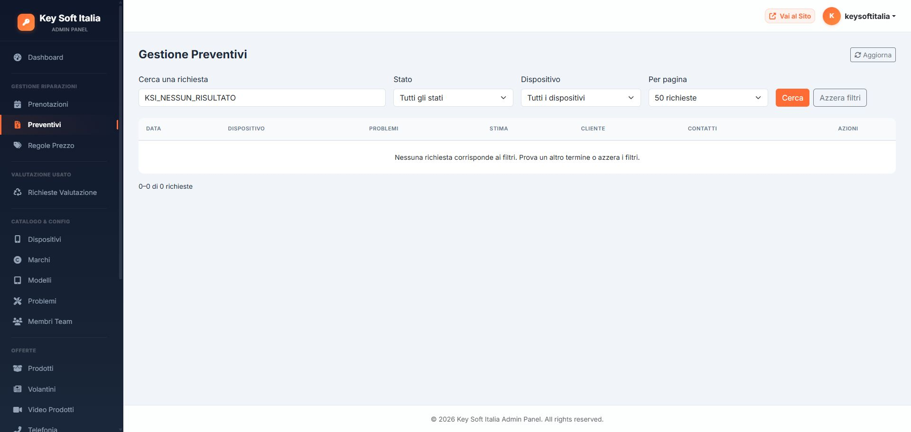

# Ricerca, paginazione e feedback admin — 5 ottobre 2026

## Modifiche

- Preventivi, valutazioni usato e prenotazioni: ricerca nel database per nome completo, email, telefono, marca, modello e ID; nei preventivi anche azienda. Filtri per stato e, nei preventivi, dispositivo.
- Pagine da 25, 50 o 100 richieste, conteggio dei risultati e ordinamento stabile per data e ID. La ricerca include i record oltre la prima pagina. Un numero di pagina non più disponibile viene riportato all'ultima pagina valida.
- Filtri nell'URL, pulsante per azzerarli e messaggio esplicito quando non ci sono risultati. I caratteri `%` e `_` vengono cercati letteralmente; valori array o dimensioni di pagina sconosciute non producono errori PHP.
- Telefonia, luce/gas, volantini, video e team: ricerca e paginazione degli elenchi già caricati, con aggiornamento automatico dopo il caricamento AJAX. Questi moduli continuano a caricare l'intero elenco dal server; la paginazione è nel browser.
- Nelle tre liste principali i messaggi di errore compaiono nella scheda aperta, senza cancellare i dati inseriti. Errori di rete, risposta server, sessione e validazione hanno messaggi distinti. I pulsanti di invio vengono disabilitati durante la richiesta e ripristinati, comprese le icone, al termine.
- Salvataggi ed eliminazioni riusciti ricaricano conteggi e pagina conservando i filtri e mostrando la conferma dell'operazione.

## Verifica

- `tests/admin-list.php --local`: **23 test**, con 165 richieste temporanee su MySQL, per ricerca oltre pagina 1, combinazione dei filtri, ordinamento, pagine, caratteri speciali e input malformato. La transazione viene annullata e i conteggi controllati. MySQL può consumare numeri AUTO_INCREMENT anche dopo il rollback.
- `node tests/admin-feedback.cjs`: **8 test** su successo, errori HTTP 401/403/422, rete interrotta, JSON invalido, errore applicativo e invii duplicati.
- Suite precedenti: **194 test** ancora superati, inclusi 123 test con HTTP/MySQL reali. Totale: **225 test**.
- Browser autenticato: apertura Dettagli nei preventivi, ricerca senza risultati e dimensione pagina mantenuta nell'URL; caricamento dei filtri in valutazioni e prenotazioni; ricerca team, conteggio zero, ripristino dell'elenco e navigazione nascosta con una sola pagina. Nessun salvataggio o eliminazione su dati clienti effettuato nel browser.
- Controllata la sintassi PHP e JavaScript dei file interessati.

La ricerca SQL usa LIKE: per archivi molto grandi sarà opportuno misurare i tempi e valutare indici o ricerca full-text. La paginazione secondaria oltre una pagina non è stata verificata nel browser con record reali, perché il campione team locale contiene cinque righe.

