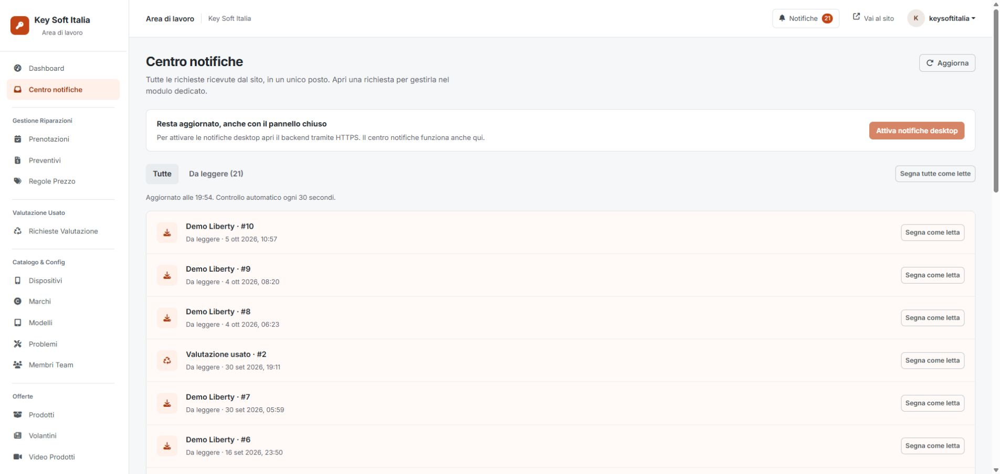

# Restyle e notifiche richieste — 5 ottobre 2026

## Stato

Implementazione locale pronta: nuovo tema condiviso, dashboard operativa, centro notifiche, sottoscrizioni Web Push e invio tramite processo CLI. Le tre nuove tabelle sono state create nel database locale; le chiavi VAPID locali sono in `config/runtime/web-push.json`, ignorato da Git e non accessibile via HTTP. Le 21 richieste storiche presenti sono state importate come notifiche da leggere. Nessun dato cliente è stato modificato.

**Le notifiche desktop non sono ancora attivate sul sito pubblico.** Occorrono deploy, HTTPS, processo periodico e consenso del browser. L'ambiente locale `http://keysoftitalia.test` non è un contesto sicuro per Web Push. L'interfaccia lo segnala e mantiene funzionante il centro notifiche.

## Comportamento

- Campanella con conteggio da leggere su tutte le pagine che usano il layout condiviso.
- Centro notifiche con elenco paginato, filtro da leggere, stato letto separato per amministratore, aggiornamento ogni 30 secondi e apertura del modulo pertinente. Preventivi, usato e prenotazioni aprono direttamente la scheda del record; telefonia e luce/gas aprono la scheda richieste.
- Preventivi, usato, prenotazioni, telefonia, luce/gas e demo vengono recuperati dalle rispettive tabelle. La sincronizzazione è idempotente e cerca record mancanti, anche quando le transazioni finiscono fuori ordine. Importa fino a 250 record per categoria a ogni esecuzione.
- Contatti e assistenza validi vengono salvati nel centro notifiche prima dell'invio email, per conservarli anche se SMTP fallisce. Le richieste precedenti a questa modifica, mai salvate nel database, non possono essere recuperate dalle sole email.
- Web Push usa `minishlink/web-push`, VAPID e payload cifrati. Gli avvisi sono generici, senza nomi, recapiti o testi dei clienti. Il clic apre il centro notifiche; l'autenticazione resta necessaria.
- Più arrivi nello stesso ciclo producono un avviso per browser. Il cursore di consegna avanza soltanto dopo un invio riuscito; gli errori temporanei restano da ritentare. Le sottoscrizioni scadute vengono rimosse. Gli account eliminati non ricevono nuovi invii.
- Una nuova sottoscrizione parte dalle richieste già importate e non invia avvisi per lo storico. Ogni browser/dispositivo va attivato separatamente.
- La lettura non cambia lo stato commerciale della richiesta. Disattivare le notifiche rimuove la sottoscrizione del browser corrente, senza modificare altri dispositivi.

## Attivazione sul server pubblico

Requisiti: PHP **8.2+**, MySQL/InnoDB, estensioni OpenSSL con curve EC, cURL e mbstring, HTTPS valido. Composer deve installare le dipendenze del lock file.

1. Pubblicare i file e installare le dipendenze:

   ```sh
   composer install --no-dev --no-scripts --optimize-autoloader
   php scripts/setup-notifications.php --apply --deployment
   ```

2. Conservare e proteggere `config/runtime/web-push.json`; non rigenerare le chiavi a ogni deploy. In alternativa impostare `WEB_PUSH_PUBLIC_KEY`, `WEB_PUSH_PRIVATE_KEY` e `WEB_PUSH_SUBJECT`. Il subject predefinito è `mailto:info@keysoftitalia.it`.
3. Configurare sul proprio hosting un cron job ogni minuto, adattando i percorsi:

   ```cron
   * * * * * /usr/bin/php /percorso/keysoftitalia/scripts/send-admin-notifications.php >> /percorso/non-pubblico/admin-push.log 2>&1
   ```

4. Aprire il centro notifiche su HTTPS, premere **Attiva notifiche desktop** e consentire nel browser. Inviare una richiesta di prova, chiudere le schede del backend e verificare la ricezione.

Il browser e il sistema operativo possono ritardare o bloccare gli avvisi quando sono spenti, in sospensione o con notifiche disabilitate. Il centro notifiche conserva comunque le richieste. Non viene garantito un avviso con computer spento. Gli invii hanno TTL di un'ora.

Su Laragon/Windows la generazione delle chiavi può richiedere `OPENSSL_CONF` prima dell'avvio PHP:

```powershell
$env:OPENSSL_CONF='C:/laragon/bin/php/php-8.3.16-Win32-vs16-x64/extras/ssl/openssl.cnf'
php scripts/setup-notifications.php --apply
```

I processi CLI non sono esposti come endpoint web. Su server diversi da Apache applicare l'equivalente blocco HTTP per `config`, `src`, `database` e `tests`.

## Verifiche

**251 test superati**: 130 integrazioni HTTP/MySQL, 52 regressioni backend, 11 fondamenta, 7 API, 1 archivio credenziali, 23 liste, 8 feedback e 19 notifiche. I test notifiche verificano isolamento dello stato letto, limite del “segna tutte”, paginazione, cattura contatti, sottoscrizioni, endpoint ammessi, retry, successo e scadenza.

La libreria Web Push reale firma e cifra le richieste durante i test, con trasporto HTTP simulato (503, 201, 410): nessun avviso esterno è stato inviato. I record di prova sono annullati tramite transazioni e i conteggi confrontati. MySQL può consumare numeri AUTO_INCREMENT anche dopo rollback.

Browser autenticato: centro notifiche e storico, filtro da leggere, apertura diretta del preventivo, stato HTTPS mancante, dashboard, menu mobile ed Escape. Verifica a 390×844: nessun overflow della pagina; le tabelle lunghe scorrono nel proprio contenitore. Sintassi di 157 file PHP e nuovi script JavaScript controllata.

**Non verificati:** consegna reale a Chrome/Edge/Firefox/Apple Push, consenso del browser, esecuzione cron sul server pubblico, ogni modal di ogni modulo e pagina login in sessione anonima. Questi richiedono il dominio HTTPS e la configurazione hosting.

## Audit delle skill richieste

Applicati Impeccable e Web Interface Guidelines al layout condiviso e al centro notifiche. Find Skills è stato usato per ricercare competenze Web Push; nessuna skill aggiuntiva installata, perché i risultati adatti non miglioravano il lavoro sul backend PHP esistente.

Valutazione Impeccable del perimetro nuovo: accessibilità 3/4, prestazioni 3/4, responsive 3/4, tema 3/4, anti-pattern 4/4: **16/20**. Non è una certificazione WCAG dell'intero backend.

- Corretti: focus visibile, skip link, etichette dei nuovi controlli, aggiornamenti annunciati, icone decorative, stati del menu ed esclusione dalla tastiera quando chiuso, Escape, contrasto del pulsante arancione, movimento ridotto, scorrimento delle tabelle e dimensioni dei pulsanti mobile. L'aggiornamento automatico non ricrea le righe se i dati non sono cambiati, preservando il focus.
- I warning del design hook su palette, dimensioni dei caratteri e raggi si riferivano ai token del sito pubblico. Sono estensioni intenzionali per il prodotto admin: documentate in DESIGN.md/frontmatter e sidecar, senza disattivare regole. Il raggio del contatore è una pillola e l'ombra mobile è un fondale di navigazione; non sono decorazioni delle schede.
- Restano stili inline e controlli storici nei moduli non riscritti: il tema condiviso li uniforma, ma serve una verifica pagina per pagina per certificare tutti i contrasti e le etichette.
- Il centro notifiche carica 25 righe; la sincronizzazione può scansionare gli archivi esistenti. Per grandi volumi misurare il costo e migrare all'inserimento degli eventi nella stessa transazione della richiesta.

Fonti: [Web Interface Guidelines](https://github.com/vercel-labs/web-interface-guidelines), [MDN Push API](https://developer.mozilla.org/en-US/docs/Web/API/Push_API), [libreria Web Push PHP](https://github.com/web-push-libs/web-push-php).


